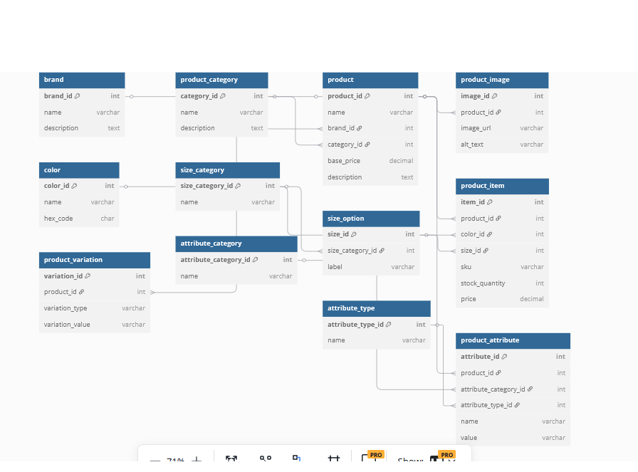

#  E-Commerce Database Schema

This project contains the SQL schema and entity-relationship diagram (ERD) for an e-commerce platform. It supports dynamic product management, variations (e.g., size, color), and extensible attributes.

## Technologies
- MySQL
- SQL (DDL)
- ERD design tools: dbdiagram.io / Lucidchart / MySQL Workbench

## ERD Overview



##  Tables Included
- brand
- product_category
- product
- product_image
- color
- size_category
- size_option
- product_item
- product_variation
- attribute_category
- attribute_type
- product_attribute

##  Data Flow Summary

1. Admin creates *brands, **categories, and **products*
2. Variations like *color* and *size* are added
3. *Product items* (combinations) are created for purchase
4. Extra *attributes* like material or weight can be attached

## Files

- ecommerce.sql - Complete schema with comments
- ERD.png - Visual entity-relationship diagram

## How to Use

1. Clone the repo
2. Run the SQL file in MySQL Workbench or any compatible tool:
   ```sql
   SOURCE ecommerce.sql;